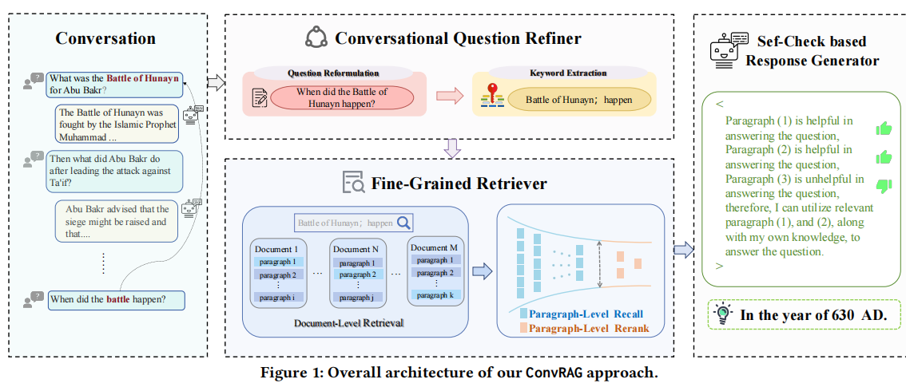
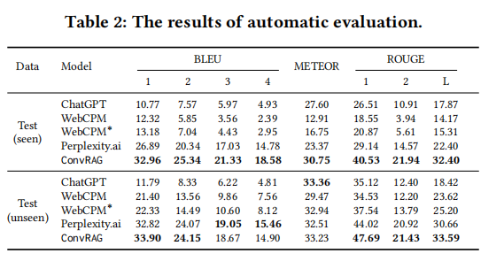

<!-- omit in toc -->

# Boosting Conversational Question Answering with Fine-GrainedRetrieval-Augmentation and Self-Check
This repo contains our datasets, and our work has been accepted by SIGIR 2024.

## Table of Contents
- [Reference](#reference)
- [Introduction](#introduction)
- [Experiments](#experiments)
- [Acknowledgments](#acknowledgments)
## Reference
We would appreciate if you could refer to our work as one of your baselines!
```
@article{ye2024boosting,
  title={Boosting Conversational Question Answering with Fine-Grained Retrieval-Augmentation and Self-Check},
  author={Ye, Linhao and Lei, Zhikai and Yin, Jianghao and Chen, Qin and Zhou, Jie and He, Liang},
  journal={arXiv preprint arXiv:2403.18243},
  year={2024}
}
```
## Introduction
Retrieval-Augmented Generation (RAG) aims to generate more reliable and accurate responses, by augmenting large language models (LLMs) with the external vast and dynamic knowledge. Most previous work focuses on using RAG for single-round question answering, while how to adapt RAG to the complex conversational setting wherein the question is interdependent on the preceding context is not well studied. In this paper, we propose a conversation-level RAG (ConvRAG) approach, which incorporates fine-grained retrieval augmentation and self-check for conversational question answering (CQA). In particular, our approach consists of three components, namely conversational question refiner, fine-grained retriever and self-check based response generator, which work collaboratively for question understanding and relevant information acquisition in conversational settings. Extensive experiments demonstrate the great advantages of our approach over the state-of-the-art baselines. Moreover, we also release a Chinese CQA dataset with new features including reformulated question, extracted keyword, retrieved paragraphs and their helpfulness, which facilitates further researches in RAG enhanced CQA.

## Experiments
Comparison of ConvRAG to prior methods. 



## Acknowledgments
We would like to thank the following individuals and organizations for their contributions to this project:
```
the National Science and Technology Major Project (No.2021ZD0114002)
the Science and Technology Commission of Shanghai Municipality Grant (No.22511105901,
No.21511100402).
```

